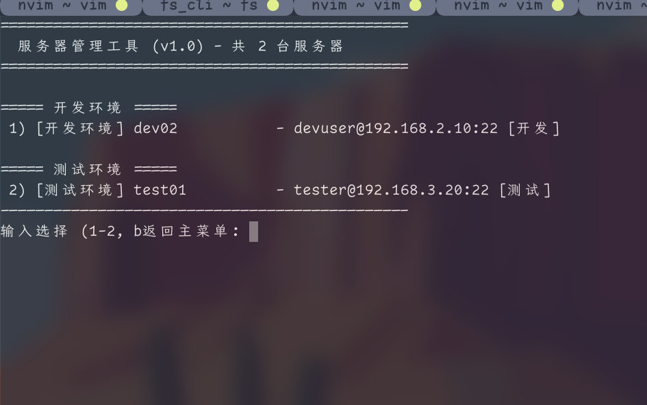

# mssh

- mssh is a Chinese, interactive command line tool to manage passwords and ssh connections
  - mssh是一个中文的、交互式的管理ssh密码和连接的命令行工具

- menu 菜单

- servers 服务器列表

- just run `./install.sh` when root user, or `sudo ./install.sh` for other users
  - root用户直接运行`./install.sh`，其他管理用户运行`sudo ./install.sh`
