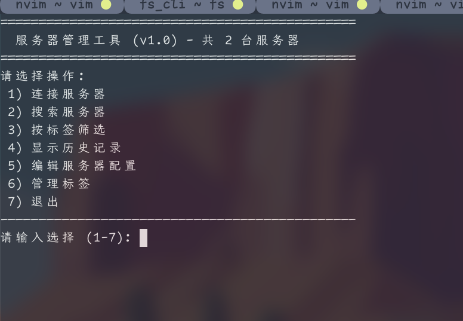

# mssh

- mssh is a Chinese, interactive command line tool to manage passwords and ssh connections
  - mssh是一个中文的、交互式的管理ssh密码和连接的命令行工具

- menu 菜单


- servers 服务器列表


- just run `./install.sh` when root user, or `sudo ./install.sh` for other users
  - root用户直接运行`./install.sh`，其他管理用户运行`sudo ./install.sh`

- configurations 配置
  - 第一次启动ms时候会生成配置文件示例，可以参照配置文件管理

```config
# 服务器配置格式：
# 别名|用户名|密码|主机/IP|端口|标签(可选)
#
# 示例：
# web01|admin|P@ssw0rd1|192.168.1.101|22|生产,重要
# db01|root|MyS3cret!|10.0.0.55|2222|生产,数据库
# backup|backup|simplepass|backup.example.com|22|备份
# dev01|deploy|d3ployKey!|172.16.8.42|22|开发
#
# 分组使用空行分隔：
[开发环境]
dev02|devuser|devpass|192.168.2.10|22|开发

[测试环境]
test01|tester|testpass|192.168.3.20|22|测试
```

- run 运行

```bash
ms # /usr/local/bin/ms
```
